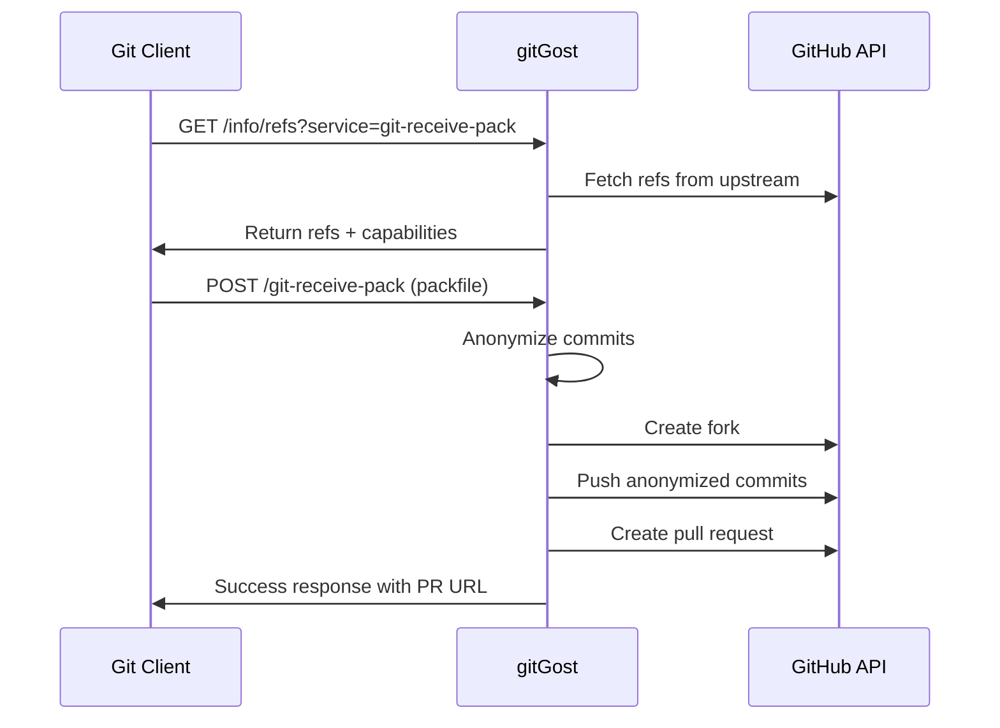
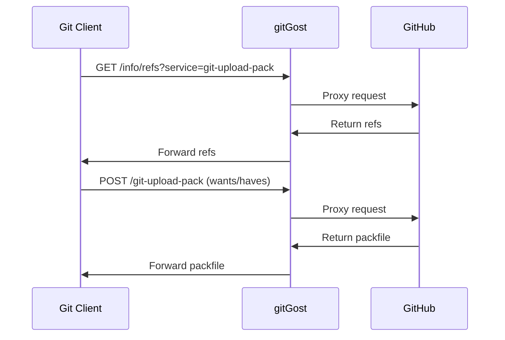

## Overview

gitGost implements the **Git Smart HTTP protocol** as defined in the Git documentation. This protocol enables Git clients to communicate with the gitGost service using standard `git push` and `git fetch` commands over HTTP/HTTPS.

The Smart HTTP protocol consists of two main phases:

1. **Discovery Phase** - Client discovers available references and capabilities
2. **Data Transfer Phase** - Client sends or receives packfiles

## Protocol Flow

### Push Operation (git push)



### Fetch Operation (git fetch/pull)



## PKT-Line Format

The Git Smart HTTP protocol uses the **pkt-line** format for all communication. Each line is prefixed with a 4-character hexadecimal length.

### Format Specification

- **Length Prefix**: 4 hex digits (includes the 4 bytes itself)
- **Data**: Variable length payload
- **Flush Packet**: `0000` - indicates end of section

### Examples

```
0032git-upload-pack /project.git\0host=example.com\0
```

Breakdown:
- `0032` = 50 bytes total (0x32 = 50)
- Payload is 46 bytes

```
0000
```

Flush packet (end of section)

### Implementation

gitGost implements pkt-line parsing and writing:

```go
// Write a pkt-line
func WritePktLine(w io.Writer, data string) error {
    if data == "" {
        _, err := w.Write([]byte("0000"))
        return err
    }
    length := len(data) + 4
    _, err := fmt.Fprintf(w, "%04x%s", length, data)
    return err
}
```

Source: `internal/http/handlers.go:46-55`

## Capabilities

gitGost advertises the following capabilities during the discovery phase:

### Receive-Pack (Push) Capabilities

<ResponseField name="report-status" type="capability">
  Server will send detailed status about ref updates
</ResponseField>

<ResponseField name="delete-refs" type="capability">
  Client can delete remote references
</ResponseField>

<ResponseField name="side-band-64k" type="capability">
  Multiplexed progress, error, and data on a single connection
</ResponseField>

<ResponseField name="quiet" type="capability">
  Suppress server-side progress messages
</ResponseField>

<ResponseField name="ofs-delta" type="capability">
  Server understands offset deltas in packfiles
</ResponseField>

<ResponseField name="push-options" type="capability">
  Client can send push options (e.g., `pr-hash=abc123`)
</ResponseField>

**Implementation**: See `internal/http/handlers.go:100`

## Side-Band-64k Protocol

The side-band-64k protocol allows the server to send three types of messages to the client:

<ParamField name="Band 1" type="byte" default="0x01">
  **Protocol data** - Standard Git protocol responses
</ParamField>

<ParamField name="Band 2" type="byte" default="0x02">
  **Progress messages** - Human-readable status updates shown to user
</ParamField>

<ParamField name="Band 3" type="byte" default="0x03">
  **Error messages** - Fatal errors that abort the operation
</ParamField>

### Side-Band Format

Each side-band message follows this structure:

```
<length><band><message>
```

- **length**: 4-byte hex length (includes band byte and message)
- **band**: 1-byte band identifier (0x01, 0x02, or 0x03)
- **message**: Variable-length data

### Example Implementation

```go
func WriteSidebandLine(w io.Writer, band byte, message string) error {
    if message == "" {
        return nil
    }
    if !strings.HasSuffix(message, "\n") {
        message += "\n"
    }
    
    data := append([]byte{band}, []byte(message)...)
    length := len(data) + 4
    
    fmt.Fprintf(w, "%04x", length)
    w.Write(data)
    return nil
}
```

Source: `internal/http/handlers.go:58-77`

## Authentication

gitGost requires **no authentication** for push operations to maintain complete anonymity. The service authenticates with GitHub on behalf of the user using its own bot account.

<Note>
  The anonymous nature of gitGost means:
  - No username/password required from users
  - No SSH keys needed
  - No GitHub tokens from contributors
  - Complete metadata anonymization
</Note>

## Protocol Endpoints

The Git Smart HTTP protocol is implemented through specific endpoints:

- **Discovery**: `GET /v1/gh/:owner/:repo/info/refs?service=<service>`
- **Data Transfer**: `POST /v1/gh/:owner/:repo/<service>`

See individual endpoint documentation:
- [Receive-Pack (Push)](/api/receive-pack)
- [Upload-Pack (Fetch)](/api/upload-pack)

## Push Options

gitGost supports custom push options for advanced workflows:

<ParamField name="pr-hash" type="string">
  Specify an existing PR hash to update an existing pull request instead of creating a new one
  
  **Usage**:
  ```bash
  git push gost main -o pr-hash=a3f8c1d2
  ```
</ParamField>

Push options are parsed during the packfile extraction phase:

```go
if strings.HasPrefix(lineStr, "push-option=pr-hash=") {
    prHash = strings.TrimPrefix(lineStr, "push-option=pr-hash=")
    prHash = strings.TrimRight(prHash, "\n")
}
```

Source: `internal/git/receive.go:86-90`

## Security & Rate Limiting

gitGost implements multiple layers of protection:

### Per-IP Rate Limiting

- **Limit**: 5 PRs per hour per IP address
- **Window**: 1 hour sliding window
- **Response**: HTTP 200 with error in side-band channel

### Global Burst Detection

- **Monitors**: Push attempts across all IPs
- **Threshold**: 20 pushes from 10+ IPs in 60 seconds
- **Action**: Admin notification via ntfy

### Panic Mode

When activated, all push operations are rejected:

```
remote: SERVICE TEMPORARILY SUSPENDED
remote: The panic button has been activated.
remote: Please try again in 15 minutes.
```

## Content-Type Headers

Git Smart HTTP uses specific Content-Type headers:

### Discovery Phase

<ResponseField name="git-receive-pack" type="Content-Type">
  `application/x-git-receive-pack-advertisement`
</ResponseField>

<ResponseField name="git-upload-pack" type="Content-Type">
  `application/x-git-upload-pack-advertisement`
</ResponseField>

### Data Transfer Phase

<ResponseField name="receive-pack request" type="Content-Type">
  `application/x-git-receive-pack-request`
</ResponseField>

<ResponseField name="receive-pack result" type="Content-Type">
  `application/x-git-receive-pack-result`
</ResponseField>

<ResponseField name="upload-pack request" type="Content-Type">
  `application/x-git-upload-pack-request`
</ResponseField>

<ResponseField name="upload-pack result" type="Content-Type">
  `application/x-git-upload-pack-result`
</ResponseField>

## Related Resources

<CardGroup cols={2}>
  <Card title="Receive-Pack API" icon="arrow-up-from-bracket" href="/api/receive-pack">
    POST endpoint for pushing commits
  </Card>
  <Card title="Upload-Pack API" icon="arrow-down-to-bracket" href="/api/upload-pack">
    POST endpoint for fetching commits
  </Card>
  <Card title="Git Protocol Docs" icon="book" href="https://git-scm.com/docs/http-protocol">
    Official Git Smart HTTP specification
  </Card>
  <Card title="Quickstart Guide" icon="rocket" href="/quickstart">
    Get started with gitGost in 2 minutes
  </Card>
</CardGroup>