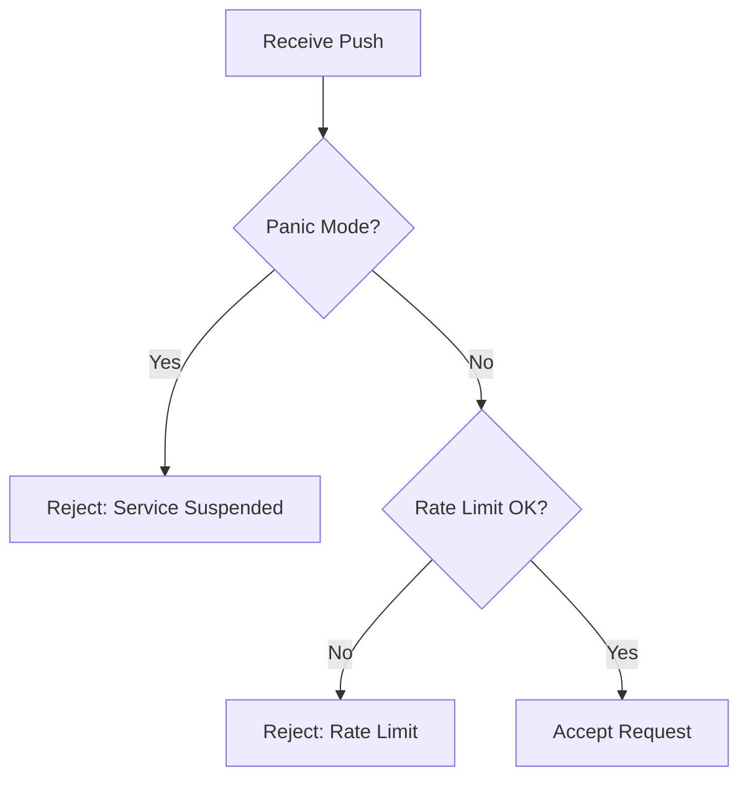

## Overview

The receive-pack endpoint implements the Git Smart HTTP protocol for **push operations**. When you run `git push gost main`, this endpoint receives your commits, anonymizes all metadata, and creates a pull request on your behalf.

## Endpoints

### Discovery: Get References

```http
GET /v1/gh/:owner/:repo/info/refs?service=git-receive-pack
```

Returns available references (branches, tags) and server capabilities.

<ParamField path="owner" type="string" required>
  GitHub repository owner (user or organization)
</ParamField>

<ParamField path="repo" type="string" required>
  Repository name
</ParamField>

<ParamField query="service" type="string" required>
  Must be `git-receive-pack`
</ParamField>

#### Response

<ResponseField name="Content-Type" type="string">
  `application/x-git-receive-pack-advertisement`
</ResponseField>

**Example Response** (pkt-line format):

```
001e# service=git-receive-pack\n
0000
00a527d1f28...c7f refs/heads/main\0report-status delete-refs side-band-64k quiet ofs-delta push-options\n
008f5e8a91b...4d2 refs/heads/dev\n
0000
```

**Implementation**: `internal/http/handlers.go:79-128`

### Data Transfer: Push Commits

```http
POST /v1/gh/:owner/:repo/git-receive-pack
```

Receives a Git packfile containing commits, anonymizes them, and creates a pull request.

<ParamField path="owner" type="string" required>
  GitHub repository owner
</ParamField>

<ParamField path="repo" type="string" required>
  Repository name
</ParamField>

#### Request Headers

<ParamField header="Content-Type" type="string" required>
  `application/x-git-receive-pack-request`
</ParamField>

<ParamField header="Expect" type="string">
  Git clients typically send `100-continue` for large pushes
</ParamField>

#### Request Body

Binary Git packfile in pkt-line format:

1. **Command Section**: Reference updates
   ```
   <old-sha> <new-sha> <ref>\0<capabilities>\n
   ```

2. **Push Options** (optional):
   ```
   push-option=pr-hash=<hash>\n
   ```

3. **Packfile**: Binary pack data starting with `PACK`

**Example Structure**:

```
00820000000000000000000000000000000000000000 a3f8c1d2... refs/heads/main\0report-status side-band-64k\n
0000
[binary packfile data: PACK...]
```

#### Response

<ResponseField name="Content-Type" type="string">
  `application/x-git-receive-pack-result`
</ResponseField>

The response uses the **side-band-64k** protocol with three channels:

<ResponseField name="Band 1 (0x01)" type="protocol">
  Protocol responses: `unpack ok`, `ok refs/heads/main`
</ResponseField>

<ResponseField name="Band 2 (0x02)" type="progress">
  Progress messages shown to user
</ResponseField>

<ResponseField name="Band 3 (0x03)" type="error">
  Error messages
</ResponseField>

**Success Response** (decoded):

```
remote: gitGost: Processing your anonymous contribution...
remote: gitGost: Commits anonymized successfully
remote: gitGost: Creating fork...
remote: gitGost: Fork ready at gitgost-bot/example-repo
remote: gitGost: Pushing to fork...
remote: gitGost: Branch 'gitgost-a3f8c1d2' created
remote: gitGost: Creating pull request...
remote: 
remote: ========================================
remote: SUCCESS! Pull Request Created
remote: ========================================
remote: 
remote: PR URL: https://github.com/owner/repo/pull/123
remote: Author: @gitgost-anonymous
remote: Branch: gitgost-a3f8c1d2
remote: PR Hash: a3f8c1d2
remote: 
remote: Subscribe to PR notifications (no account needed):
remote:   https://ntfy.sh/gitgost-pr-a3f8c1d2
remote: 
remote: To update this PR on future pushes, use:
remote:   git push gost <branch>:main -o pr-hash=a3f8c1d2
remote: 
remote: Your identity has been anonymized.
remote: No trace to you remains in the commit history.
remote: 
remote: ========================================

unpack ok
ok refs/heads/main
```

**Implementation**: `internal/http/handlers.go:130-407`

## Processing Flow

When you push commits, gitGost performs the following operations:

### 1. Request Validation



### 2. Packfile Processing

<Steps>
  <Step title="Clone Repository">
    gitGost clones the target repository from GitHub to establish the object database
    
    ```go
    git.PlainClone(tempDir, false, &git.CloneOptions{
        URL: "https://github.com/owner/repo.git",
        Auth: &http.BasicAuth{
            Username: "x-access-token",
            Password: token,
        },
    })
    ```
    
    Source: `internal/git/receive.go:153-159`
  </Step>
  
  <Step title="Extract Packfile">
    Parse the pkt-line protocol to extract:
    - Reference updates (old SHA → new SHA)
    - Push options (e.g., `pr-hash`)
    - Binary packfile data
    
    ```go
    packfile, refUpdate, prHash, err := ExtractPackfile(body)
    ```
    
    Source: `internal/git/receive.go:184`
  </Step>
  
  <Step title="Unpack Objects">
    Import objects from packfile into the repository:
    
    ```bash
    git index-pack -v --stdin --fix-thin
    # or fallback to:
    git unpack-objects -r
    ```
    
    Source: `internal/git/receive.go:205-224`
  </Step>
  
  <Step title="Anonymize Commits">
    Rewrite commit metadata to remove all identifying information:
    
    - **Author**: `@gitgost-anonymous <anonymous@gitgost.local>`
    - **Committer**: `@gitgost-anonymous <anonymous@gitgost.local>`
    - **Timestamp**: Current server time
    - **Preserve**: Commit message, tree, parents
    
    Only new commits (not in origin/main) are rewritten.
    
    Source: `internal/git/receive.go:252-258`, `internal/git/receive.go:262-304`
  </Step>
</Steps>

### 3. GitHub Integration

<Steps>
  <Step title="Fork Repository">
    Create a fork under the gitGost bot account
    
    ```http
    POST https://api.github.com/repos/:owner/:repo/forks
    ```
    
    Returns the fork owner name (e.g., `gitgost-bot`)
  </Step>
  
  <Step title="Push to Fork">
    Push the anonymized commits to a uniquely-named branch:
    
    ```
    gitgost-a3f8c1d2
    ```
    
    Branch name is deterministic based on repo and timestamp.
  </Step>
  
  <Step title="Create Pull Request">
    Open a PR from `gitgost-bot:gitgost-a3f8c1d2` to `owner:main`
    
    ```http
    POST https://api.github.com/repos/:owner/:repo/pulls
    {
      "title": "<first line of commit message>",
      "head": "gitgost-bot:gitgost-a3f8c1d2",
      "base": "main",
      "body": "<commit body>"
    }
    ```
  </Step>
  
  <Step title="Notify User">
    Publish notification to ntfy topic:
    
    ```
    https://ntfy.sh/gitgost-pr-a3f8c1d2
    ```
    
    User can subscribe (no account required) for PR updates.
  </Step>
</Steps>

## Push Options

Git 2.10+ allows sending custom options with push commands:

### pr-hash Option

<ParamField name="pr-hash" type="string">
  Update an existing PR instead of creating a new one
</ParamField>

**Usage**:

```bash
git push gost main -o pr-hash=a3f8c1d2
```

When provided, gitGost will:

1. Check if branch `gitgost-a3f8c1d2` exists in the fork
2. Force-push new commits to that branch
3. Look for an open PR from that branch
4. Update the PR (if open) or create a new one (if closed)

**Implementation**: `internal/http/handlers.go:242-292`

## Metadata Stripping

gitGost completely removes identifying information from commits:

### Before Anonymization

```
commit a3f8c1d2e4b6f8a9c0d1e2f3a4b5c6d7e8f9a0b1
Author: John Doe <john@example.com>
Committer: John Doe <john@example.com>
Date: Mon Mar 5 14:23:45 2026 -0800

Fix typo in documentation
```

### After Anonymization

```
commit b9e8d7c6a5f4e3d2c1b0a9f8e7d6c5b4a3f2e1d0
Author: @gitgost-anonymous <anonymous@gitgost.local>
Committer: @gitgost-anonymous <anonymous@gitgost.local>
Date: Thu Mar 5 22:30:12 2026 +0000

Fix typo in documentation
```

<Note>
  **What's preserved**: Commit message, file changes, tree structure
  
  **What's removed**: Author name, email, original timestamp, any PGP signatures
</Note>

The anonymization process creates entirely new commit objects with new SHA hashes. Source: `internal/git/receive.go:336-367`

## Rate Limiting

gitGost implements multiple layers of rate limiting:

### Per-IP Rate Limit

<ParamField name="limit" type="number" default="5">
  Maximum PRs per hour per IP address
</ParamField>

<ParamField name="window" type="duration" default="1 hour">
  Sliding time window
</ParamField>

When exceeded, the push is rejected with:

```
remote: Rate limit exceeded: max 5 PRs per hour per IP.
remote: Please try again later.
push rejected: rate limit exceeded
```

**Implementation**: `internal/http/handlers.go:160-172`

### Global Burst Detection

Detects coordinated bot attacks:

<ParamField name="max_total" type="number" default="20">
  Max pushes globally in 60 seconds
</ParamField>

<ParamField name="max_ips" type="number" default="10">
  Max distinct IPs in 60 seconds
</ParamField>

When triggered:
- Admin receives ntfy alert
- Admin can activate panic mode
- Admin can rollback recent PRs

**Implementation**: `internal/http/handlers.go:665-704`

## Error Handling

All errors are returned via side-band channel 3:

### Common Errors

<Accordion title="Push Rejected: Service Temporarily Suspended">
  **Cause**: Panic mode is active
  
  **Resolution**: Wait 15 minutes or contact admin
  
  **Code**: `internal/http/handlers.go:142-156`
</Accordion>

<Accordion title="Push Rejected: Rate Limit Exceeded">
  **Cause**: Too many PRs from your IP
  
  **Resolution**: Wait up to 1 hour
  
  **Code**: `internal/http/handlers.go:161-172`
</Accordion>

<Accordion title="Unpack Error">
  **Cause**: Invalid or corrupted packfile
  
  **Resolution**: Ensure repository is not corrupted, try re-cloning
  
  **Code**: `internal/http/handlers.go:212-218`
</Accordion>

<Accordion title="Error Creating Fork">
  **Cause**: GitHub API failure or repository doesn't exist
  
  **Resolution**: Verify repository exists and is public
  
  **Code**: `internal/http/handlers.go:225-233`
</Accordion>

<Accordion title="Error Creating PR">
  **Cause**: PR already exists or API failure
  
  **Resolution**: Check if PR already exists for your changes
  
  **Code**: `internal/http/handlers.go:311-319`
</Accordion>

## Example: Full Push Flow

### 1. Add gitGost Remote

```bash
git remote add gost https://gitgost.leapcell.app/v1/gh/owner/repo.git
```

### 2. Make Changes

```bash
echo "# Fix typo" >> README.md
git add README.md
git commit -m "Fix typo in README"
```

### 3. Push Anonymously

```bash
git push gost main
```

**Client Output**:

```
Enumerating objects: 5, done.
Counting objects: 100% (5/5), done.
Delta compression using up to 8 threads
Compressing objects: 100% (3/3), done.
Writing objects: 100% (3/3), 356 bytes | 356.00 KiB/s, done.
Total 3 (delta 1), reused 0 (delta 0), pack-reused 0
remote: gitGost: Processing your anonymous contribution...
remote: gitGost: Commits anonymized successfully
remote: gitGost: Creating fork...
remote: gitGost: Fork ready at gitgost-bot/example-repo
remote: gitGost: Pushing to fork...
remote: gitGost: Branch 'gitgost-a3f8c1d2' created
remote: gitGost: Creating pull request...
remote: 
remote: ========================================
remote: SUCCESS! Pull Request Created
remote: ========================================
remote: 
remote: PR URL: https://github.com/owner/repo/pull/42
remote: Author: @gitgost-anonymous
remote: Branch: gitgost-a3f8c1d2
remote: PR Hash: a3f8c1d2
remote: 
remote: Subscribe to PR notifications:
remote:   https://ntfy.sh/gitgost-pr-a3f8c1d2
remote: 
To https://gitgost.leapcell.app/v1/gh/owner/repo.git
 * [new branch]      main -> main
```

### 4. Subscribe to Updates

Visit `https://ntfy.sh/gitgost-pr-a3f8c1d2` or use the ntfy app to receive notifications when:
- PR is commented on
- PR is merged
- PR is closed

### 5. Update the PR

```bash
# Make more changes
echo "More fixes" >> README.md
git add README.md
git commit -m "Additional fixes"

# Update existing PR
git push gost main -o pr-hash=a3f8c1d2
```

## Related Resources

<CardGroup cols={2}>
  <Card title="Git Smart HTTP" icon="git-alt" href="/api/git-smart-http">
    Learn about the protocol gitGost implements
  </Card>
  <Card title="Upload-Pack" icon="arrow-down-to-bracket" href="/api/upload-pack">
    Fetch operations (git pull/fetch)
  </Card>
  <Card title="Quickstart" icon="rocket" href="/quickstart">
    Get started in 2 minutes
  </Card>
  <Card title="How It Works" icon="gears" href="/how-it-works">
    Technical deep dive
  </Card>
</CardGroup>