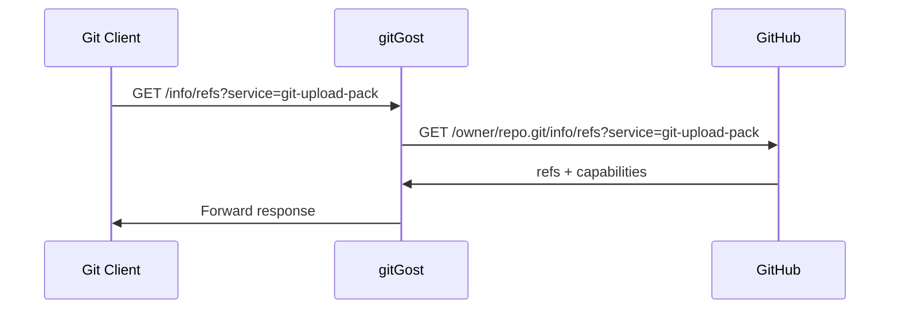
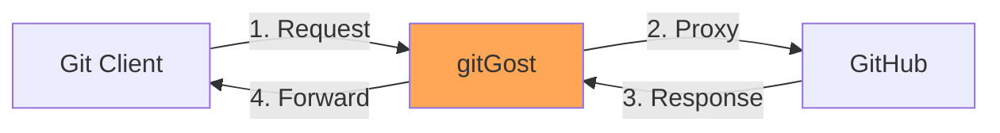

## Overview

The upload-pack endpoint implements the Git Smart HTTP protocol for **fetch operations**. This endpoint allows you to clone and pull from repositories through gitGost, which proxies requests directly to GitHub.

<Note>
  Upload-pack operations are **read-only** and do not modify repository state. They're used for `git clone`, `git fetch`, and `git pull` operations.
</Note>

## Endpoints

### Discovery: Get References

```http
GET /v1/gh/:owner/:repo/info/refs?service=git-upload-pack
```

Returns available references (branches, tags) and server capabilities from GitHub.

<ParamField path="owner" type="string" required>
  GitHub repository owner (user or organization)
</ParamField>

<ParamField path="repo" type="string" required>
  Repository name
</ParamField>

<ParamField query="service" type="string" required>
  Must be `git-upload-pack`
</ParamField>

#### Request Headers

<ParamField header="User-Agent" type="string">
  gitGost sends `git/2.0` when proxying to GitHub
</ParamField>

#### Response

<ResponseField name="Content-Type" type="string">
  `application/x-git-upload-pack-advertisement`
</ResponseField>

<ResponseField name="WWW-Authenticate" type="string">
  `None` - No authentication required
</ResponseField>

The response is proxied directly from GitHub and contains:

**Example Response** (pkt-line format):

```
001e# service=git-upload-pack\n
0000
00a527d1f28...c7f refs/heads/main\0multi_ack thin-pack side-band side-band-64k ofs-delta shallow deepen-since deepen-not\n
003f5e8a91b...4d2 refs/heads/dev\n
003aabc123...def refs/tags/v1.0.0\n
0000
```

**Implementation**: `internal/http/handlers.go:409-435`

**Flow**:



### Data Transfer: Fetch Objects

```http
POST /v1/gh/:owner/:repo/git-upload-pack
```

Receives a request specifying desired commits (wants) and existing commits (haves), returns a packfile containing the requested objects.

<ParamField path="owner" type="string" required>
  GitHub repository owner
</ParamField>

<ParamField path="repo" type="string" required>
  Repository name
</ParamField>

#### Request Headers

<ParamField header="Content-Type" type="string" required>
  `application/x-git-upload-pack-request`
</ParamField>

<ParamField header="Accept" type="string">
  `application/x-git-upload-pack-result`
</ParamField>

<ParamField header="User-Agent" type="string">
  gitGost sends `git/2.0` when proxying
</ParamField>

#### Request Body

The request body uses pkt-line format to specify:

<ParamField name="want" type="string[]">
  SHA-1 hashes of commits the client wants to fetch
  
  ```
  want 27d1f28...c7f\n
  want 5e8a91b...4d2\n
  ```
</ParamField>

<ParamField name="have" type="string[]">
  SHA-1 hashes of commits the client already has (optional)
  
  ```
  have abc123...def\n
  have 789fed...cba\n
  ```
</ParamField>

<ParamField name="done" type="marker">
  Signals end of negotiation
  
  ```
  done\n
  ```
</ParamField>

**Example Request** (decoded):

```
0098want 27d1f28...c7f multi_ack_detailed no-done side-band-64k thin-pack ofs-delta\n
0032want 5e8a91b...4d2\n
0000
0032have abc123...def\n
0009done\n
```

#### Response

<ResponseField name="Content-Type" type="string">
  `application/x-git-upload-pack-result`
</ResponseField>

The response is a packfile containing the requested objects, proxied directly from GitHub.

**Response Format**:

```
PACK<version><num-objects><objects...><checksum>
```

- **Signature**: `PACK` (4 bytes)
- **Version**: 2 or 3 (4 bytes, network byte order)
- **Object Count**: Number of objects (4 bytes)
- **Objects**: Compressed object data
- **Checksum**: SHA-1 of the preceding data (20 bytes)

**Implementation**: `internal/http/handlers.go:437-476`

## Size Limits

To prevent abuse, gitGost enforces a size limit on upload-pack requests:

<ParamField name="maxUploadBytes" type="number" default="52428800">
  Maximum request body size: **50 MB**
</ParamField>

```go
const maxUploadBytes = 50 * 1024 * 1024 // 50 MB
c.Request.Body = http.MaxBytesReader(c.Writer, c.Request.Body, maxUploadBytes)
```

Source: `internal/http/handlers.go:441-442`

If exceeded, the server returns:

```json
{
  "error": "request body too large"
}
```

HTTP Status: `413 Request Entity Too Large`

## Proxy Architecture

gitGost acts as a transparent proxy for fetch operations:



### Why Proxy?

<AccordionGroup>
  <Accordion title="No Metadata Anonymization Needed">
    Fetch operations only read data - they don't expose user identity. There's no commit metadata to strip.
  </Accordion>
  
  <Accordion title="Performance">
    Direct proxying is faster than re-serving packfiles. GitHub's CDN delivers optimal performance.
  </Accordion>
  
  <Accordion title="Compatibility">
    Ensures 100% Git protocol compatibility since GitHub is the authoritative source.
  </Accordion>
  
  <Accordion title="Consistency">
    Users always get the exact same data whether they fetch via gitGost or directly from GitHub.
  </Accordion>
</AccordionGroup>

## Use Cases

### Clone a Repository

```bash
git clone https://gitgost.leapcell.app/v1/gh/owner/repo.git
```

**What happens**:

1. Git sends `GET /info/refs?service=git-upload-pack` to discover refs
2. Git sends `POST /git-upload-pack` with wants (all branch/tag tips)
3. gitGost proxies both requests to GitHub
4. Git receives packfile and reconstructs repository

### Fetch Updates

```bash
cd repo
git fetch gost
```

**What happens**:

1. Git sends wants (remote branch tips) and haves (local commits)
2. gitGost proxies request to GitHub
3. GitHub calculates minimal packfile (only new commits)
4. Git receives and integrates new commits

### Pull Changes

```bash
git pull gost main
```

**What happens**:

1. Git performs a fetch (as above)
2. Git merges fetched changes into current branch

### Shallow Clone

```bash
git clone --depth 1 https://gitgost.leapcell.app/v1/gh/owner/repo.git
```

Shallow clones are fully supported - gitGost proxies the `deepen` capability to GitHub.

## Capabilities

GitHub (via gitGost) advertises these upload-pack capabilities:

<ResponseField name="multi_ack" type="capability">
  Server can acknowledge multiple common commits during negotiation
</ResponseField>

<ResponseField name="multi_ack_detailed" type="capability">
  Enhanced version with detailed negotiation feedback
</ResponseField>

<ResponseField name="thin-pack" type="capability">
  Server can send thin packs (packs with delta references to objects not in the pack)
</ResponseField>

<ResponseField name="side-band" type="capability">
  Multiplexed communication (progress + data)
</ResponseField>

<ResponseField name="side-band-64k" type="capability">
  Enhanced side-band with 64KB chunks
</ResponseField>

<ResponseField name="ofs-delta" type="capability">
  Pack can use offset deltas
</ResponseField>

<ResponseField name="shallow" type="capability">
  Server supports shallow clones
</ResponseField>

<ResponseField name="deepen-since" type="capability">
  Client can request commits since a date
</ResponseField>

<ResponseField name="deepen-not" type="capability">
  Client can request commits not reachable from refs
</ResponseField>

<ResponseField name="no-done" type="capability">
  Client doesn't need to send 'done' in some scenarios
</ResponseField>

These are determined by GitHub, not gitGost.

## Error Handling

### Common Errors

<Accordion title="Failed to reach GitHub (502 Bad Gateway)">
  **Cause**: GitHub is unreachable or returned an error
  
  **Resolution**: 
  - Check GitHub status: https://www.githubstatus.com/
  - Verify repository exists and is public
  - Try again in a few moments
  
  **Code**: `internal/http/handlers.go:422-425` (discovery), `internal/http/handlers.go:464-467` (data transfer)
</Accordion>

<Accordion title="Request body too large (413)">
  **Cause**: Request exceeds 50 MB limit
  
  **Resolution**: This should rarely happen in practice. If it does, the repository may have unusual characteristics. Clone directly from GitHub instead.
  
  **Code**: `internal/http/handlers.go:445-447`
</Accordion>

<Accordion title="Failed to read body (400)">
  **Cause**: Malformed request or connection error
  
  **Resolution**: Check network connection, update Git client
  
  **Code**: `internal/http/handlers.go:448-451`
</Accordion>

<Accordion title="Invalid repo name (400)">
  **Cause**: Repository path contains invalid characters
  
  **Resolution**: Ensure owner and repo names only contain alphanumeric characters, hyphens, underscores, and dots
  
  **Code**: `internal/http/router.go:78-92` (validation middleware)
</Accordion>

## Comparison: Fetch vs Push

| Aspect | Upload-Pack (Fetch) | Receive-Pack (Push) |
|--------|-----------------------|---------------------|
| **Direction** | Server → Client | Client → Server |
| **Operation** | Read-only | Write (creates PR) |
| **Anonymization** | None needed | Full metadata stripping |
| **gitGost Role** | Transparent proxy | Active processor |
| **GitHub Auth** | None | gitGost bot account |
| **Rate Limiting** | None | 5 PRs/hour/IP |
| **Use Cases** | Clone, fetch, pull | Push for PR creation |

## Implementation Details

### Discovery Handler

```go
func UploadPackDiscoveryHandler(c *gin.Context) {
    owner := c.Param("owner")
    repo := c.Param("repo")
    
    githubURL := fmt.Sprintf(
        "https://github.com/%s/%s.git/info/refs?service=git-upload-pack",
        owner, repo,
    )
    
    req, err := http.NewRequest("GET", githubURL, nil)
    if err != nil {
        c.AbortWithStatusJSON(http.StatusInternalServerError,
            gin.H{"error": "failed to build request"})
        return
    }
    req.Header.Set("User-Agent", "git/2.0")
    
    resp, err := uploadPackClient.Do(req)
    if err != nil {
        c.AbortWithStatusJSON(http.StatusBadGateway,
            gin.H{"error": "failed to reach GitHub"})
        return
    }
    defer resp.Body.Close()
    
    c.Writer.Header().Set("Content-Type",
        "application/x-git-upload-pack-advertisement")
    c.Writer.Header().Set("WWW-Authenticate", "None")
    c.Writer.WriteHeader(resp.StatusCode)
    io.Copy(c.Writer, resp.Body)
}
```

Source: `internal/http/handlers.go:409-435`

### Data Transfer Handler

```go
func UploadPackHandler(c *gin.Context) {
    owner := c.Param("owner")
    repo := c.Param("repo")
    
    const maxUploadBytes = 50 * 1024 * 1024
    c.Request.Body = http.MaxBytesReader(c.Writer, c.Request.Body, maxUploadBytes)
    body, err := io.ReadAll(c.Request.Body)
    if err != nil {
        if err.Error() == "http: request body too large" {
            c.AbortWithStatusJSON(http.StatusRequestEntityTooLarge,
                gin.H{"error": "request body too large"})
            return
        }
        c.AbortWithStatusJSON(http.StatusBadRequest,
            gin.H{"error": "failed to read body"})
        return
    }
    
    githubURL := fmt.Sprintf(
        "https://github.com/%s/%s.git/git-upload-pack",
        owner, repo,
    )
    
    req, err := http.NewRequest("POST", githubURL, bytes.NewReader(body))
    if err != nil {
        c.AbortWithStatusJSON(http.StatusInternalServerError,
            gin.H{"error": "failed to build request"})
        return
    }
    req.Header.Set("Content-Type", "application/x-git-upload-pack-request")
    req.Header.Set("Accept", "application/x-git-upload-pack-result")
    req.Header.Set("User-Agent", "git/2.0")
    
    resp, err := uploadPackClient.Do(req)
    if err != nil {
        c.AbortWithStatusJSON(http.StatusBadGateway,
            gin.H{"error": "failed to reach GitHub"})
        return
    }
    defer resp.Body.Close()
    
    c.Writer.Header().Set("Content-Type", "application/x-git-upload-pack-result")
    c.Writer.WriteHeader(resp.StatusCode)
    io.Copy(c.Writer, resp.Body)
}
```

Source: `internal/http/handlers.go:437-476`

### HTTP Client Configuration

```go
var uploadPackClient = &http.Client{
    Timeout: 30 * time.Second,
}
```

Source: `internal/http/handlers.go:31`

<Note>
  The 30-second timeout is sufficient for most operations. Large repositories may occasionally time out - in such cases, clone directly from GitHub.
</Note>

## Examples

### Clone via gitGost

```bash
# Clone a repository
git clone https://gitgost.leapcell.app/v1/gh/torvalds/linux.git

# Output:
Cloning into 'linux'...
remote: Enumerating objects: 10234567, done.
remote: Counting objects: 100% (234/234), done.
remote: Compressing objects: 100% (156/156), done.
remote: Total 10234567 (delta 89), reused 198 (delta 78), pack-reused 10234333
Receiving objects: 100% (10234567/10234567), 3.2 GiB | 45.2 MiB/s, done.
Resolving deltas: 100% (8234567/8234567), done.
```

### Add as Remote

```bash
cd my-repo
git remote add gost https://gitgost.leapcell.app/v1/gh/owner/repo.git

# Fetch from gitGost
git fetch gost

# Pull from gitGost
git pull gost main
```

### Shallow Clone for CI

```bash
# Clone only the latest commit
git clone --depth 1 https://gitgost.leapcell.app/v1/gh/owner/repo.git

# Clone commits from last week
git clone --shallow-since="1 week ago" https://gitgost.leapcell.app/v1/gh/owner/repo.git
```

## When to Use gitGost for Fetching

<CardGroup cols={2}>
  <Card title="Consistent Workflow" icon="repeat">
    Use the same remote for both fetch and push operations
    
    ```bash
    git remote add gost https://gitgost.leapcell.app/v1/gh/owner/repo.git
    git pull gost main
    git push gost main
    ```
  </Card>
  
  <Card title="Testing" icon="flask">
    Test the full gitGost integration including fetch operations
  </Card>
  
  <Card title="Unified Interface" icon="link">
    Build tools that interact with repositories exclusively through gitGost
  </Card>
  
  <Card title="Monitoring" icon="chart-line">
    Track all Git operations through a single endpoint
  </Card>
</CardGroup>

<Warning>
  For most use cases, fetching directly from GitHub is simpler and may be faster. Use gitGost for fetching primarily when you need a unified interface or are testing the service.
</Warning>

## Related Resources

<CardGroup cols={2}>
  <Card title="Git Smart HTTP" icon="git-alt" href="/api/git-smart-http">
    Learn about the protocol gitGost implements
  </Card>
  <Card title="Receive-Pack" icon="arrow-up-from-bracket" href="/api/receive-pack">
    Push operations (git push)
  </Card>
  <Card title="Quickstart" icon="rocket" href="/quickstart">
    Get started with gitGost in 2 minutes
  </Card>
  <Card title="Architecture" icon="sitemap" href="/essentials/architecture">
    System architecture overview
  </Card>
</CardGroup>