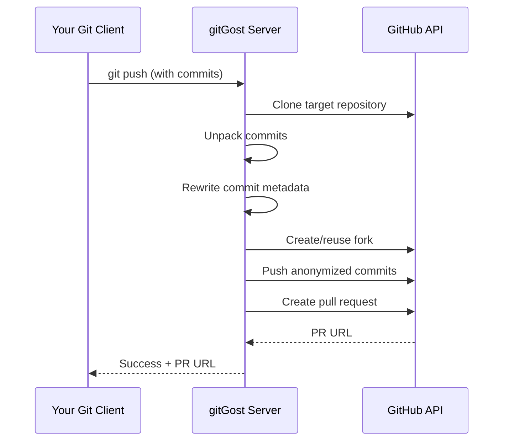

# How gitGost Works

This page explains the technical implementation of gitGost, including the Git Smart HTTP protocol, metadata stripping process, and PR creation workflow.

## Architecture Overview

gitGost acts as a transparent proxy between your Git client and GitHub, intercepting and rewriting commit metadata before creating pull requests through a bot account.



## Git Smart HTTP Protocol

gitGost implements the [Git Smart HTTP protocol](https://git-scm.com/docs/http-protocol), which GitHub uses for push/pull operations over HTTPS.

### Protocol Endpoints

gitGost exposes four endpoints that mirror GitHub's Smart HTTP protocol:

<CodeGroup>
```go Upload Pack Discovery
// GET /v1/gh/{owner}/{repo}/info/refs?service=git-upload-pack
// Used by git clone and git fetch
func UploadPackDiscoveryHandler(c *gin.Context) {
    owner := c.Param("owner")
    repo := c.Param("repo")
    
    githubURL := fmt.Sprintf("https://github.com/%s/%s.git/info/refs?service=git-upload-pack", owner, repo)
    // Proxy to GitHub...
}
```

```go Upload Pack
// POST /v1/gh/{owner}/{repo}/git-upload-pack
// Used to fetch objects (clone/fetch)
func UploadPackHandler(c *gin.Context) {
    owner := c.Param("owner")
    repo := c.Param("repo")
    
    // Read request body and proxy to GitHub
    githubURL := fmt.Sprintf("https://github.com/%s/%s.git/git-upload-pack", owner, repo)
    // ...
}
```

```go Receive Pack Discovery
// GET /v1/gh/{owner}/{repo}/info/refs?service=git-receive-pack
// Used by git push to discover capabilities
func ReceivePackDiscoveryHandler(c *gin.Context) {
    owner := c.Param("owner")
    repo := c.Param("repo")
    
    // Get refs from GitHub
    refs, err := github.GetRefs(owner, repo)
    // Build advertisement with capabilities
    capabilities := "report-status delete-refs side-band-64k quiet ofs-delta push-options"
    // ...
}
```

```go Receive Pack (Push)
// POST /v1/gh/{owner}/{repo}/git-receive-pack
// This is where the anonymization magic happens
func ReceivePackHandler(c *gin.Context) {
    // Rate limiting, abuse checks...
    // Process packfile and anonymize commits
    // Create fork, push, and open PR
}
```
</CodeGroup>

*Source: internal/http/handlers.go*

### Pkt-Line Protocol

Git uses a framing protocol called **pkt-line** to transmit data. Each line is prefixed with a 4-byte hexadecimal length:

```text
0032git-upload-pack /project.git\0host=example.com\0
0000
```

The length includes the 4-byte prefix itself. `0000` is a special flush packet.

gitGost implements pkt-line parsing:

```go
func ParsePktLine(r io.Reader) ([]byte, error) {
    lenBuf := make([]byte, 4)
    _, err := io.ReadFull(r, lenBuf)
    if err != nil {
        return nil, err
    }
    
    lenStr := string(lenBuf)
    if lenStr == "0000" {
        return nil, nil // flush packet
    }
    
    length, err := strconv.ParseInt(lenStr, 16, 32)
    if err != nil {
        return nil, fmt.Errorf("invalid pkt-line length: %s", lenStr)
    }
    
    // Read data (length - 4 bytes for the length prefix)
    dataLen := int(length) - 4
    data := make([]byte, dataLen)
    _, err = io.ReadFull(r, data)
    return data, err
}
```

*Source: internal/git/receive.go:20-50*

## Push Processing Flow

When you run `git push gost my-branch:main`, here's what happens:

<Steps>
  <Step title="Client sends packfile">
    Your Git client sends a packfile containing:
    - Ref update commands (old SHA → new SHA)
    - Commit objects
    - Tree objects
    - Blob objects (file contents)
    - Optional push-options (e.g., `pr-hash=a3f8c1d2`)
    
    ```go
    func ExtractPackfile(body []byte) ([]byte, *RefUpdate, string, error) {
        reader := bytes.NewReader(body)
        var refUpdate *RefUpdate
        var prHash string
        
        // Parse ref update commands
        for {
            line, err := ParsePktLine(reader)
            if line == nil { break } // flush packet
            
            // Parse push-option: pr-hash=<value>
            if strings.HasPrefix(lineStr, "push-option=pr-hash=") {
                prHash = strings.TrimPrefix(lineStr, "push-option=pr-hash=")
            }
            
            // Parse command: old-sha new-sha ref
            parts := strings.Fields(lineStr)
            if len(parts) >= 3 {
                refUpdate = &RefUpdate{
                    OldSHA: parts[0],
                    NewSHA: parts[1],
                    Ref:    parts[2],
                }
            }
        }
        
        // Read remaining bytes as packfile
        packfile, err := io.ReadAll(reader)
        return packfile, refUpdate, prHash, nil
    }
    ```
    
    *Source: internal/git/receive.go:61-140*
  </Step>
  
  <Step title="gitGost clones the target repository">
    To have the base objects for unpacking your commits, gitGost clones the target repository:
    
    ```go
    func ReceivePack(tempDir string, body []byte, owner string, repo string) (string, string, string, error) {
        token := os.Getenv("GITHUB_TOKEN")
        repoURL := fmt.Sprintf("https://github.com/%s/%s.git", owner, repo)
        
        _, err := git.PlainClone(tempDir, false, &git.CloneOptions{
            URL: repoURL,
            Auth: &http.BasicAuth{
                Username: "x-access-token",
                Password: token,
            },
        })
        // If clone fails (private repo), initialize empty
        if err != nil {
            git.PlainInit(tempDir, false)
        }
    }
    ```
    
    *Source: internal/git/receive.go:143-167*
  </Step>
  
  <Step title="Unpack the packfile">
    gitGost uses Git's `index-pack` command to unpack your commits:
    
    ```go
    // Save packfile to disk
    packfilePath := tempDir + "/pack.tmp"
    os.WriteFile(packfilePath, packfile, 0644)
    
    // Unpack using git index-pack (more robust than unpack-objects)
    cmd := exec.Command("git", "index-pack", "-v", "--stdin", "--fix-thin")
    cmd.Dir = tempDir + "/.git/objects/pack"
    cmd.Stdin = bytes.NewReader(packfile)
    
    output, err := cmd.CombinedOutput()
    if err != nil {
        // Fallback to unpack-objects if index-pack fails
        cmd = exec.Command("git", "unpack-objects", "-r")
        cmd.Dir = tempDir
        cmd.Stdin = bytes.NewReader(packfile)
        output, err = cmd.CombinedOutput()
    }
    ```
    
    *Source: internal/git/receive.go:204-225*
  </Step>
  
  <Step title="Update HEAD to new commit">
    ```go
    // Open repository
    r, err := git.PlainOpen(tempDir)
    
    // Update HEAD to the new commit SHA from the ref update
    newHash := plumbing.NewHash(refUpdate.NewSHA)
    ref := plumbing.NewHashReference(plumbing.HEAD, newHash)
    r.Storer.SetReference(ref)
    ```
    
    *Source: internal/git/receive.go:228-240*
  </Step>
</Steps>

## Metadata Stripping

This is the core of gitGost's anonymization. All commits in your push are rewritten to replace identifying metadata.

### Commit Rewriting

gitGost recursively rewrites commits, preserving the tree (file contents) but replacing author and committer information:

```go
func AnonymizeCommits(r *git.Repository, targetSHA string) (string, error) {
    targetHash := plumbing.NewHash(targetSHA)
    targetCommit, err := r.CommitObject(targetHash)
    
    // Get all commits that already exist in origin/main (base commits)
    baseCommits := make(map[plumbing.Hash]bool)
    originMain, err := r.Reference(plumbing.NewRemoteReferenceName("origin", "main"), true)
    if err == nil {
        // Mark all base commits (don't rewrite these)
        iter, _ := r.Log(&git.LogOptions{From: originMain.Hash()})
        iter.ForEach(func(c *object.Commit) error {
            baseCommits[c.Hash] = true
            return nil
        })
    }
    
    // Rewrite only new commits
    commitMap := make(map[plumbing.Hash]plumbing.Hash)
    newHash, err := rewriteCommit(r, targetCommit, commitMap, baseCommits)
    
    // Update HEAD to the anonymized commit
    ref := plumbing.NewHashReference(plumbing.HEAD, newHash)
    r.Storer.SetReference(ref)
    
    return newHash.String(), nil
}
```

*Source: internal/git/receive.go:262-304*

### Recursive Rewriting

```go
func rewriteCommit(r *git.Repository, commit *object.Commit, commitMap map[plumbing.Hash]plumbing.Hash, baseCommits map[plumbing.Hash]bool) (plumbing.Hash, error) {
    // Already rewritten? Return cached result
    if newHash, exists := commitMap[commit.Hash]; exists {
        return newHash, nil
    }
    
    // Base commit (from origin/main)? Don't rewrite
    if baseCommits[commit.Hash] {
        return commit.Hash, nil
    }
    
    // Rewrite parent commits first (depth-first)
    var newParents []plumbing.Hash
    for _, parentHash := range commit.ParentHashes {
        parentCommit, err := r.CommitObject(parentHash)
        if err != nil {
            // Parent doesn't exist (shallow clone?), use original hash
            newParents = append(newParents, parentHash)
            continue
        }
        newParentHash, err := rewriteCommit(r, parentCommit, commitMap, baseCommits)
        newParents = append(newParents, newParentHash)
    }
    
    // Create new commit with anonymized signature
    anonSignature := object.Signature{
        Name:  "@gitgost-anonymous",
        Email: "anonymous@gitgost.local",
        When:  time.Now(), // Current timestamp (obfuscates when you actually worked)
    }
    
    newCommit := &object.Commit{
        Author:       anonSignature,
        Committer:    anonSignature,
        Message:      commit.Message, // Preserve commit message
        TreeHash:     commit.TreeHash, // Preserve file contents
        ParentHashes: newParents,
    }
    
    // Encode and store the new commit
    obj := r.Storer.NewEncodedObject()
    newCommit.Encode(obj)
    newHash, err := r.Storer.SetEncodedObject(obj)
    
    // Cache the mapping
    commitMap[commit.Hash] = newHash
    return newHash, nil
}
```

*Source: internal/git/receive.go:306-368*

### What Gets Changed

<CodeGroup>
```diff Before (Your Original Commit)
commit a1b2c3d4e5f6g7h8i9j0k1l2m3n4o5p6q7r8s9t0
Author: John Doe <john@example.com>
Date:   Mon Mar 5 14:23:45 2026 -0800

    fix: correct spelling in README
    
    Fixed 'recieve' → 'receive' in installation section.

tree 9f8e7d6c5b4a3e2d1c0b9a8f7e6d5c4b3a2e1d0c
parent f0e1d2c3b4a5e6d7c8b9a0f1e2d3c4b5a6e7d8c9
```

```diff After (Anonymized by gitGost)
commit z9y8x7w6v5u4t3s2r1q0p9o8n7m6l5k4j3i2h1g0
Author: @gitgost-anonymous <anonymous@gitgost.local>
Date:   Mon Mar 5 22:24:01 2026 +0000

    fix: correct spelling in README
    
    Fixed 'recieve' → 'receive' in installation section.

tree 9f8e7d6c5b4a3e2d1c0b9a8f7e6d5c4b3a2e1d0c
parent f0e1d2c3b4a5e6d7c8b9a0f1e2d3c4b5a6e7d8c9
```
</CodeGroup>

**What's preserved:**
- Commit message (this becomes your PR description)
- Tree hash (file contents are unchanged)
- Parent relationships (history structure is preserved)

**What's changed:**
- Author name and email
- Committer name and email
- Commit timestamp (replaced with current time)
- Commit hash (changes due to metadata changes)

<Note>
  The **tree hash** (file contents) remains identical. Only metadata changes. This ensures your code contribution is exactly what you intended.
</Note>

## Fork Creation and Management

After anonymizing commits, gitGost pushes them to a fork owned by the `@gitgost-anonymous` bot.

### Creating or Reusing a Fork

```go
func ForkRepo(owner, repo string) (string, error) {
    token := os.Getenv("GITHUB_TOKEN")
    
    // Get the bot's username
    userURL := "https://api.github.com/user"
    req, _ := http.NewRequest("GET", userURL, nil)
    req.Header.Set("Authorization", "token "+token)
    resp, _ := http.DefaultClient.Do(req)
    
    var user map[string]interface{}
    json.NewDecoder(resp.Body).Decode(&user)
    forkOwner := user["login"].(string) // e.g., "gitgost-anonymous"
    
    // Check if fork already exists
    forkURL := fmt.Sprintf("https://api.github.com/repos/%s/%s", forkOwner, repo)
    req, _ = http.NewRequest("GET", forkURL, nil)
    req.Header.Set("Authorization", "token "+token)
    resp, _ = http.DefaultClient.Do(req)
    
    if resp.StatusCode == 200 {
        // Fork exists, reuse it
        return forkOwner, nil
    }
    
    // Create new fork
    url := fmt.Sprintf("https://api.github.com/repos/%s/%s/forks", owner, repo)
    req, _ = http.NewRequest("POST", url, nil)
    req.Header.Set("Authorization", "token "+token)
    resp, _ = http.DefaultClient.Do(req)
    
    return forkOwner, nil
}
```

*Source: internal/github/pr.go:431-503*

### Pushing to the Fork

```go
func PushToGitHub(owner, repo, tempDir, forkOwner, targetBranch string) (string, error) {
    token := os.Getenv("GITHUB_TOKEN")
    
    // Generate unique branch name (or use provided one for updates)
    branch := targetBranch
    if branch == "" {
        timestamp := time.Now().Unix()
        branch = fmt.Sprintf("gitgost-%d", timestamp) // e.g., gitgost-1709654321
    }
    
    r, _ := git.PlainOpen(tempDir)
    
    // Add fork as remote
    forkURL := fmt.Sprintf("https://github.com/%s/%s.git", forkOwner, repo)
    r.CreateRemote(&config.RemoteConfig{
        Name: "fork",
        URLs: []string{forkURL},
    })
    
    // Push to fork (force if updating existing branch)
    refSpec := fmt.Sprintf("HEAD:refs/heads/%s", branch)
    if targetBranch != "" {
        refSpec = "+" + refSpec // Force push for updates
    }
    
    r.Push(&git.PushOptions{
        RemoteName: "fork",
        RefSpecs:   []config.RefSpec{config.RefSpec(refSpec)},
        Auth: &http.BasicAuth{
            Username: "x-access-token",
            Password: token,
        },
        Force: targetBranch != "",
    })
    
    return branch, nil
}
```

*Source: internal/git/push.go:20-80*

### Fork Cleanup

<Warning>
  Due to GitHub's 40,000 repository limit per account, forks created by `@gitgost-anonymous` are **manually deleted** periodically. Your PR remains open, but the fork may be removed.
</Warning>

This is a GitHub platform constraint, not a gitGost limitation. Once your PR is merged or closed, the fork is no longer needed.

## Pull Request Creation

The final step is creating a PR from the fork to the original repository.

```go
func CreatePR(owner, repo, branch, forkOwner, commitMessage string) (string, error) {
    token := os.Getenv("GITHUB_TOKEN")
    url := fmt.Sprintf("https://api.github.com/repos/%s/%s/pulls", owner, repo)
    
    // Use commit message as PR description
    prBody := fmt.Sprintf(
        "%s\n\n---\n\n*This is an anonymous contribution made via [gitGost](https://gitgost.leapcell.app).*\n\n*The original author's identity has been anonymized to protect their privacy.*",
        commitMessage,
    )
    
    data := map[string]interface{}{
        "title": "Anonymous contribution via gitGost",
        "head":  fmt.Sprintf("%s:%s", forkOwner, branch), // e.g., "gitgost-anonymous:gitgost-1709654321"
        "base":  "main",
        "body":  prBody,
    }
    
    jsonData, _ := json.Marshal(data)
    req, _ := http.NewRequest("POST", url, bytes.NewBuffer(jsonData))
    req.Header.Set("Authorization", "token "+token)
    req.Header.Set("Content-Type", "application/json")
    
    resp, _ := http.DefaultClient.Do(req)
    
    var result map[string]interface{}
    json.NewDecoder(resp.Body).Decode(&result)
    prURL := result["html_url"].(string)
    
    return prURL, nil
}
```

*Source: internal/github/pr.go:550-605*

### PR Structure

The created PR looks like this:

**Title**: "Anonymous contribution via gitGost"

**Description**:
```markdown
fix: correct spelling in README

Fixed 'recieve' → 'receive' in installation section.

---

*This is an anonymous contribution made via [gitGost](https://gitgost.leapcell.app).*

*The original author's identity has been anonymized to protect their privacy.*
```

**Author**: `@gitgost-anonymous`

**Branch**: `gitgost-anonymous:gitgost-1709654321` → `owner:main`

## Updating Existing PRs

gitGost supports updating PRs without creating duplicates using the `pr-hash` push-option.

### PR Hash Generation

The PR hash is **deterministic**—it's generated from the owner/repo/branch combination:

```go
func GeneratePRHash(owner, repo, branch string) string {
    input := fmt.Sprintf("%s/%s/%s", owner, repo, branch)
    sum := sha256.Sum256([]byte(input))
    return hex.EncodeToString(sum[:])[:8] // First 8 characters
}
```

*Source: internal/github/pr.go:658-662*

### Update Workflow

<Steps>
  <Step title="Client sends pr-hash">
    ```bash
    git push gost my-branch:main -o pr-hash=a3f8c1d2
    ```
    
    The `-o` flag sends a push-option with the PR hash.
  </Step>
  
  <Step title="gitGost looks up existing PR">
    ```go
    func GetExistingPR(owner, repo, forkOwner, branchName string) (string, bool, error) {
        token := os.Getenv("GITHUB_TOKEN")
        
        // Check if branch exists in fork
        branchURL := fmt.Sprintf("https://api.github.com/repos/%s/%s/branches/%s", forkOwner, repo, branchName)
        req, _ := http.NewRequest("GET", branchURL, nil)
        req.Header.Set("Authorization", "token "+token)
        resp, _ := httpClient.Do(req)
        
        if resp.StatusCode != http.StatusOK {
            return "", false, nil // Branch doesn't exist
        }
        
        // Search for open PR from this branch
        head := fmt.Sprintf("%s:%s", forkOwner, branchName)
        prListURL := fmt.Sprintf("https://api.github.com/repos/%s/%s/pulls?state=open&head=%s", owner, repo, head)
        req, _ = http.NewRequest("GET", prListURL, nil)
        resp, _ = httpClient.Do(req)
        
        var prs []struct{ HTMLURL string `json:"html_url"` }
        json.NewDecoder(resp.Body).Decode(&prs)
        
        if len(prs) == 0 {
            return "", true, nil // Branch exists but PR closed/merged
        }
        
        return prs[0].HTMLURL, true, nil
    }
    ```
    
    *Source: internal/github/pr.go:666-729*
  </Step>
  
  <Step title="Force-push to existing branch">
    If the PR exists, gitGost force-pushes to the same branch:
    
    ```go
    // Use the branch name from the pr-hash
    branch := fmt.Sprintf("gitgost-%s", receivedPRHash)
    
    // Force-push updates
    branch, err = git.PushToGitHub(owner, repo, tempDir, forkOwner, branch)
    ```
    
    GitHub automatically updates the PR with the new commits.
  </Step>
</Steps>

## Security and Abuse Prevention

gitGost implements multiple layers of protection:

### Rate Limiting

```go
func checkRateLimit(ip string) bool {
    now := time.Now()
    rateLimitMu.Lock()
    times := rateLimitStore[ip]
    
    // Keep only timestamps within the 1-hour window
    valid := times[:0]
    for _, t := range times {
        if now.Sub(t) < time.Hour {
            valid = append(valid, t)
        }
    }
    valid = append(valid, now)
    rateLimitStore[ip] = valid
    count := len(valid)
    rateLimitMu.Unlock()
    
    return count > 5 // Max 5 PRs per hour per IP
}
```

*Source: internal/http/handlers.go:733-759*

### Global Burst Detection

gitGost detects coordinated attacks across multiple IPs:

```go
func recordGlobalBurst(ip string) {
    now := time.Now()
    globalBurstMu.Lock()
    defer globalBurstMu.Unlock()
    
    // Slide 60-second window
    cutoff := now.Add(-60 * time.Second)
    newTimes := globalBurstTimes[:0]
    newIPs := globalBurstIPs[:0]
    for i, t := range globalBurstTimes {
        if t.After(cutoff) {
            newTimes = append(newTimes, t)
            newIPs = append(newIPs, globalBurstIPs[i])
        }
    }
    newTimes = append(newTimes, now)
    newIPs = append(newIPs, ip)
    
    total := len(newTimes)
    distinctIPs := len(seenIPs(newIPs))
    
    // Alert if > 20 pushes or > 10 distinct IPs in 60 seconds
    if total >= 20 || distinctIPs >= 10 {
        notifyAdminGlobalBurst(total, distinctIPs)
    }
}
```

*Source: internal/http/handlers.go:665-704*

### Panic Mode

Operators can instantly suspend the service if abuse is detected:

```go
func isPanicMode() bool {
    panicMu.Lock()
    defer panicMu.Unlock()
    return panicMode
}

func ReceivePackHandler(c *gin.Context) {
    // Check panic mode first
    if isPanicMode() {
        WriteSidebandLine(&errResp, 2, "remote: SERVICE TEMPORARILY SUSPENDED")
        WriteSidebandLine(&errResp, 2, "remote: The panic button has been activated.")
        return
    }
    // ... rest of handler
}
```

*Source: internal/http/handlers.go:649-656, 142-157*

## Data Flow Summary

<Steps>
  <Step title="git push gost my-branch:main">
    Your Git client connects to `gitgost.leapcell.app` and sends a packfile over HTTPS.
  </Step>
  
  <Step title="Parse packfile (pkt-line protocol)">
    gitGost extracts ref updates, push-options, and the PACK data.
  </Step>
  
  <Step title="Clone target repo from GitHub">
    Provides base objects needed to unpack your commits.
  </Step>
  
  <Step title="Unpack commits (git index-pack)">
    Your commit objects are written to the temporary repository.
  </Step>
  
  <Step title="Rewrite commits recursively">
    All new commits are rewritten with anonymized author/committer/timestamp.
  </Step>
  
  <Step title="Create/reuse fork">
    Fork is created under `@gitgost-anonymous` (or reused if exists).
  </Step>
  
  <Step title="Push to fork">
    Anonymized commits are pushed to a unique branch in the fork.
  </Step>
  
  <Step title="Create PR">
    Pull request is opened from `gitgost-anonymous:gitgost-NNNNNNNNNN` to `owner:main`.
  </Step>
  
  <Step title="Return PR URL">
    Git client receives success message with PR URL.
  </Step>
</Steps>

## Limitations and Trade-offs

<Warning>
  gitGost makes **implementation trade-offs** for simplicity and performance. Understanding these limitations is critical for threat modeling.
</Warning>

### What gitGost Cannot Hide

<CardGroup cols={2}>
  <Card title="Network Identity" icon="network-wired">
    Your IP address is visible to the gitGost server and GitHub. Use Tor for IP anonymity.
  </Card>
  
  <Card title="Code Fingerprints" icon="fingerprint">
    Coding style, variable naming, and domain knowledge can reveal identity through stylometry.
  </Card>
  
  <Card title="Timing Correlation" icon="clock">
    If you push and the PR appears immediately, observers can correlate timing.
  </Card>
  
  <Card title="Repository Size" icon="database">
    Max 500 MB repositories, 10 MB commits. Not suitable for large contributions.
  </Card>
</CardGroup>

### Trust Assumptions

<Note>
  You must trust:
  1. The gitGost operator (doesn't add telemetry or log IPs)
  2. Your network provider (use VPN/Tor if concerned)
  3. GitHub (sees your IP during PR creation)
</Note>

For zero-trust scenarios, [self-host your own instance](/self-hosting).

## Source Code References

All code excerpts in this documentation are from the actual gitGost implementation:

- **Protocol handlers**: `internal/http/handlers.go`
- **Git operations**: `internal/git/receive.go`, `internal/git/push.go`
- **GitHub API**: `internal/github/pr.go`
- **Threat model**: `THREAT_MODEL.md`
- **Privacy guarantees**: `Privacy Guarantees.md`

View the full source: [github.com/livrasand/gitGost](https://github.com/livrasand/gitGost)

## Next Steps

<CardGroup cols={2}>
  <Card title="Quickstart" icon="rocket" href="/quickstart">
    Try gitGost with your first anonymous contribution
  </Card>
  
  <Card title="Threat Model" icon="shield-halved" href="/threat-model">
    Understand what gitGost protects against
  </Card>
  
  <Card title="Self-Hosting" icon="server" href="/self-hosting">
    Run your own gitGost instance
  </Card>
  
  <Card title="API Reference" icon="code" href="/api/git-smart-http">
    Complete API documentation
  </Card>
</CardGroup>

---

<Tip>
  **Transparency matters.** All gitGost code is open source and auditable. If you find vulnerabilities, please report them via the [security policy](https://github.com/livrasand/gitGost/security).
</Tip>