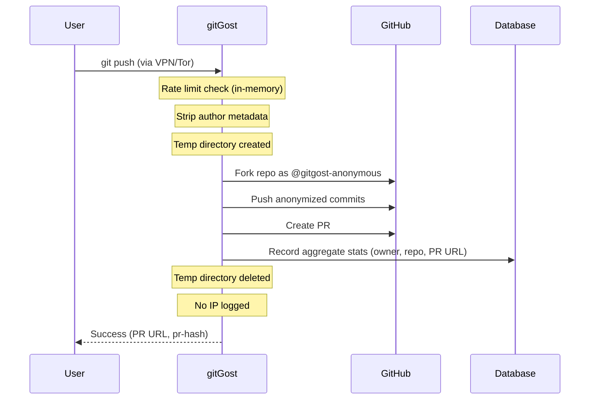

A clear summary for privacy-conscious users: what gitGost keeps, what it doesn't, and what happens in adverse scenarios.

## What is NOT Stored

<Check>**Commits, blobs, or refs you send**</Check>

Git objects only stream through to GitHub. gitGost does not persist repository data.

```go
// From handlers.go:194-200
tempDir, err := utils.CreateTempDir()
if err != nil {
    return err
}
defer utils.CleanupTempDir(tempDir) // Always cleaned up
```

<Check>**GitHub tokens or access keys**</Check>

User credentials are never transmitted to or stored by gitGost. The service uses its own bot account (`@gitgost-anonymous`) to create PRs.

<Check>**Your IP or logs containing it**</Check>

Logs are aggregated and rotated **without IP addresses**:

```go
// From router.go:129-134
gin.SetMode(gin.ReleaseMode) // Disable Gin logs
r := gin.New()
r.SetTrustedProxies([]string{}) // Use real TCP IP, not proxy headers
r.Use(gin.Recovery()) // Only recovery middleware, NO logger
```

IP addresses are used **transiently** for rate limiting but not persisted in logs.

<Check>**Emails, names, usernames, or SSH fingerprints**</Check>

All author metadata is stripped before commits are pushed to GitHub. See [Threat Model](/security/threat-model) for implementation details.

<Check>**Request histories or session metadata**</Check>

gitGost is stateless. No user sessions, cookies, or request history is maintained.

## What IS Stored (and Why)

<Info>
  gitGost stores **minimal aggregate metrics** for anti-abuse and service health. No personal identifiers.
</Info>

### 1. Minimal Aggregate Metrics

**What:** PR count, push timestamps (aggregated), service health metrics.

**Why:** Anti-abuse detection, service monitoring, and public statistics.

**Retention:** Short windows with automatic rotation.

**Example from database schema:**
```sql
-- From internal/database/supabase.go
CREATE TABLE prs (
    id SERIAL PRIMARY KEY,
    owner TEXT NOT NULL,
    repo TEXT NOT NULL,
    pr_url TEXT NOT NULL,
    created_at TIMESTAMP DEFAULT NOW()
);
-- No IP, no user identifier, no session token
```

### 2. Ephemeral Logs (No Personal Identifiers)

**What:** Operational logs for debugging failures.

**Why:** Diagnose service issues (e.g., GitHub API errors, fork failures).

**Retention:** Aggressive rotation. No IP addresses or user identifiers.

**Example from code:**
```go
// From utils/log.go
func Log(format string, args ...interface{}) {
    // Logs to stdout, rotated by platform
    // No IP, no user ID, no session token
    fmt.Printf("[gitGost] "+format+"\n", args...)
}
```

### 3. Optional Supabase Config

**What:** Anonymous persistent statistics if Supabase is enabled.

**Why:** Long-term service metrics and public transparency.

**Retention:** As configured by operator. Still no personal identifiers.

**Example:**
```go
// From handlers.go:919-924
func RecordPR(ctx context.Context, owner, repo, prURL string) error {
    // Records: owner, repo, pr_url, created_at
    // Does NOT record: IP, user token, git author, session
    return dbClient.InsertPR(ctx, owner, repo, prURL)
}
```

### 4. Rate Limiting (In-Memory, Transient)

**What:** Per-IP counters for rate limiting (5 PRs/IP/hour).

**Why:** Prevent abuse and botnet attacks.

**Retention:** Sliding window, in-memory only, not logged.

**Implementation:**
```go
// From handlers.go:559-562
rateLimitStore  = make(map[string][]time.Time) // IP → timestamps
rateLimitWindow = time.Hour
rateLimitMaxPRs = 5
```

<Warning>
  Rate limit counters are **in-memory only** and reset on service restart. They are never written to disk or logs.
</Warning>

## Retention Policies

| Data Type | Retention | Storage |
|-----------|-----------|----------|
| Git objects (commits, blobs) | None—stream-only | Temporary directory, deleted immediately |
| IP addresses | Transient (rate limit window) | In-memory only |
| Aggregate metrics | Short windows, auto-rotated | Supabase (if enabled) |
| Ephemeral logs | Aggressive rotation | Platform-dependent (stdout) |
| User tokens | Never stored | N/A |

## Scenario: Server Compromise

<Warning>
  If the gitGost server is compromised, what can an attacker access?
</Warning>

**No stored tokens or user data to exfiltrate:**
- No GitHub tokens (service uses its own bot account)
- No user credentials or SSH keys
- No session tokens or authentication state

**Logs do not contain IPs or emails:**
- Attacker gains no user identity from logs
- Aggregate metrics reveal service usage patterns but no individual users

**Response:**
- Deployment keys are rotated
- Traffic is cut and service reinstalled from clean code
- No user notification required (no user data compromised)

## Scenario: Legal Order

<Info>
  If gitGost receives a legal order to disclose user data:
</Info>

**We have no identity data to hand over:**
- No IP logs (not recorded)
- No user accounts or registration data
- No authentication tokens or credentials

**What we can provide:**
- Already-anonymized aggregate metrics (PR counts, timestamps)
- Public data (PR URLs, repositories)

**Future retention:**
If future compliance requires data retention, it will be **announced in the changelog and privacy policy before enabling**.

## Scenario: Database Loss

<Check>**The service keeps running**</Check>

gitGost works in-memory for streaming. Database is optional:

```go
// From handlers.go:927-931
if dbClient == nil {
    c.JSON(http.StatusOK, gin.H{"total_prs": 0})
    return // Service continues without database
}
```

**Impact of database loss:**
- Optional aggregate metrics are lost
- No personal data to restore (there was none)
- Service continues processing PRs normally

## What gitGost Cannot Know (Even If It Wanted To)

<CardGroup cols={2}>
  <Card title="Your Identity" icon="user-secret">
    No accounts, no registration, no user tokens. gitGost cannot know who you are.
  </Card>
  
  <Card title="Your IP Address" icon="network-wired">
    Not recorded in logs. Used transiently for rate limiting, then discarded.
  </Card>
  
  <Card title="Commit Authorship" icon="code-commit">
    Author metadata stripped before push. PRs come from `@gitgost-anonymous`.
  </Card>
  
  <Card title="Usage History" icon="clock-rotate-left">
    No persistent traces. No request history. Stateless operation.
  </Card>
</CardGroup>

## Data Flow Diagram



## Credibility Over Features

<Note>
  **Less data = less risk**
</Note>

gitGost's privacy guarantees are backed by **architectural choices**, not just promises:

1. **No authentication system** → No user accounts to compromise
2. **Stateless operation** → No session data to leak
3. **Stream-only git processing** → No repository data to exfiltrate
4. **No IP logging** → No request correlation
5. **Open source** → Auditable by anyone

## Operator Responsibilities

<Warning>
  These guarantees assume the operator follows best practices:
</Warning>

- **No custom telemetry**: Operator does not add tracking or analytics
- **Log rotation**: Platform logs are rotated and do not persist long-term
- **No reverse proxy IP logging**: If behind a proxy, IP forwarding headers are not trusted (`SetTrustedProxies([]string{})`)
- **Secure deployment**: Standard security practices (HTTPS, firewall, patching)

## Trust Model

| Party | What They Can See | What They Cannot See |
|-------|-------------------|----------------------|
| **GitHub** | PR from `@gitgost-anonymous`, timing, content | Your identity (unless you reveal it in diff/comments) |
| **gitGost Operator** | Aggregate push volume, service metrics | Your IP (if not logged), your identity, your local git history |
| **Network Observer** | Encrypted traffic to gitGost (HTTPS) | Push contents, your identity (if using VPN/Tor) |
| **Target Repo Maintainer** | PR content, timing, code style | Your identity (unless inferable from style/timing) |

## Comparison with Alternatives

| Feature | gitGost | Direct GitHub PR | Throwaway Account |
|---------|---------|------------------|-------------------|
| No identity link | ✅ | ❌ | ⚠️ Weak (email, IP) |
| Metadata stripped | ✅ | ❌ | ⚠️ Manual |
| No registration | ✅ | ❌ | ❌ |
| No IP exposure | ⚠️ Requires VPN/Tor | ❌ | ❌ |
| Auditable | ✅ Open source | ❌ Proprietary | N/A |

## Related Documentation

<CardGroup cols={2}>
  <Card title="Threat Model" icon="shield-halved" href="/security/threat-model">
    What gitGost protects against and attack vectors
  </Card>
  
  <Card title="Anonymity Limits" icon="eye" href="/security/anonymity-limits">
    When gitGost is NOT sufficient
  </Card>
  
  <Card title="Rate Limits" icon="gauge" href="/security/rate-limits">
    Abuse prevention measures
  </Card>
  
  <Card title="Source Code" icon="code" href="https://github.com/livrasand/gitGost">
    Audit the implementation yourself
  </Card>
</CardGroup>